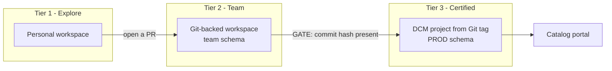

# Streamlit Development & Management: Recommended Workflow

**Audience:** DSEA Organization (practitioners) · **Duration:** 45 minutes
**Prepared for:** Luke Kranz's team · Rich Ecker, Solutions Engineering

---

## The problem, stated precisely

Users are building Streamlit dashboards that break without the data engineering team knowing, generating support load the team never signed up for. The underlying issue is not that people build apps — that is the point of self-service. The issue is that **there is no defensible line between a dashboard someone threw together and a dashboard the business depends on**, so every app becomes data engineering's problem by default.

You cannot draw that line with a naming convention or a wiki page. You need a property of the deployed object that cannot be faked or forgotten.

## The line: Git commit provenance

Snowflake records the source repository, branch, and exact Git commit on any Streamlit app deployed from a Snowflake Git repository. It is visible on the object itself:

```sql
DESCRIBE STREAMLIT CORTEX_AGENTS_DEMO.PUBLIC.CORTEX_AGENT_CHAT_APP;
```

```
default_version_source_location_uri   @...GITHUB_REPO_CORTEX_AGENTS_DEMO/branches/main/agent_app/
default_version_git_commit_hash       15e3e34e80cdc1e8d64b34a1d0b8ad206d002c1b
```

Nobody typed that hash. The deployment mechanism wrote it, which means an app that did not come from a repository cannot produce one.

| `git_commit_hash` | Means | Who supports it |
|---|---|---|
| Present | Came from a reviewed commit. Diffable, reproducible, rollback-able. | Platform / DE team |
| Absent | Built by clicking in Snowsight. No history. | The owner |

That single column is the promotion gate and the support boundary. It replaces an argument about whether an app "looks important" with a query anyone can run.

## What the audit found in a real account

`audit/streamlit_inventory.sql` inventories every app and classifies it. Run live on a working demo account:

| Finding | Count (of 80) |
|---|---|
| Total Streamlit apps | **80** |
| No Git provenance | **79 (98.8%)** |
| Legacy `ROOT_LOCATION` source model | **60 (75%)** |
| Admin-owned | 64 |
| Never named (Snowsight auto-name) | 58 |
| Undocumented | 73 |
| Streamlit version not pinned exactly | **80 (100%)** |
| Over a year old | 68 |
| Certified | **1** |

Three of these change how you plan:

**79 of 80 have no provenance.** When one breaks there is no diff to read and no commit to roll back to. That is the support-load problem in one number.

**60 of 80 are on the legacy `ROOT_LOCATION` source model.** These apps *cannot* use Git integration, *cannot* run on the container runtime, and *cannot* be multi-file edited in Snowsight. This is a hard technical ceiling, not a process gap. **Three quarters of the estate must be migrated to the `FROM` source model before a Git workflow is even possible.** Any plan that says "start using Git" is understating the work by that number. Diagnostic: `DESCRIBE STREAMLIT` returns `root_location` for legacy, `live_version_location_uri` for modern.

**80 of 80 have no exact version pin.** Range pins like `streamlit>=1.39.0` silently do not take effect on the warehouse runtime (SNOW-3601653). Every app can change behaviour with no code edit. This is the class of problem behind the filter-state bug on your own app in September, which reproduced on deployed SiS but not on local Streamlit 1.50.

One honest caveat: the single certified app is *still* admin-owned and *still* unpinned. Provenance is necessary, not sufficient — it is the gate, not the whole standard.

## The recommended pattern: three tiers, one gate



| | Tier 1 Explore | Tier 2 Team | Tier 3 Certified |
|---|---|---|---|
| Where | Personal workspace | Team schema | PROD schema |
| Owner | Individual | Named team owner role | **Functional owner role, never a person** |
| Source of truth | Whatever is in the workspace | Feature branch | Immutable Git tag |
| Deployed by | The user | `snow streamlit deploy` | DCM project via CI/CD identity |
| `git_commit_hash` | absent | present on the app object | *empty on the object* — the tag is recorded in DCM deployment history |
| In the catalog | no | no | **yes** |
| **DE supports it** | **no** | **no** | **yes** |
| When it breaks | Owner fixes or deletes | Team fixes | Incident, on-call, rollback |

One counterintuitive detail in the Certified column, verified in the account
rather than read from the docs: a DCM-deployed app carries **no** commit hash on
the Streamlit object — `source_location_uri` reads `asset://…`. Its provenance
lives in `SHOW DEPLOYMENTS IN DCM PROJECT`, in the `source_file_path` of the
latest deployment. So the audit has to accept two different kinds of evidence, and
an audit keyed only on the app object would report the most governed app in the
estate as ungoverned.

This is also why the Certified tier is defined as tag-deployed *via DCM* rather
than tag-deployed generally: `CREATE STREAMLIT` and `ALTER STREAMLIT … ADD VERSION`
reject `tags/` and `commits/` paths outright and accept only `branches/`. DCM is
the only mechanism that will deploy from an immutable tag.

Never make an individual the long-term owner of a production app. Streamlit apps run with **owner's rights** by default, so the owner role determines what every viewer can reach. An app owned by `ACCOUNTADMIN` hands admin-level data access to everyone who can open it — which is what 64 of the 80 apps above currently do.

## The permissions unblock

Non-admin users being unable to self-serve is a real blocker with a small fix. A developer needs no admin role:

```sql
GRANT USAGE ON DATABASE APP_DB              TO ROLE SIS_DEVELOPER;
GRANT USAGE ON SCHEMA APP_DB.APPS           TO ROLE SIS_DEVELOPER;
GRANT CREATE STREAMLIT ON SCHEMA APP_DB.APPS TO ROLE SIS_DEVELOPER;
GRANT USAGE ON WAREHOUSE APP_WH             TO ROLE SIS_DEVELOPER;
-- container runtime only
GRANT USAGE ON COMPUTE POOL APP_POOL        TO ROLE SIS_DEVELOPER;
```

Two things worth checking rather than assuming:

- **`CREATE STAGE` is only needed for the legacy `ROOT_LOCATION` pattern.** On the `FROM` model the app uses an embedded stage. If users are blocked on stage creation, migrating to `FROM` removes the blocker instead of requiring a new grant.
- **`CREATE STREAM` is only needed if the app itself operates on streams.** Worth confirming whether your blocked users actually need streams, or inherited that requirement from the legacy pattern. If the latter, the grant is unnecessary.

Viewers need `USAGE` on the database, schema, and the Streamlit object. Use `GRANT USAGE ON FUTURE STREAMLITS IN SCHEMA` so certified apps become visible automatically.

## Folders and workspaces

The product direction is **Workspaces**, not a folder hierarchy inside the deployed object. Workspaces give file-based development, private editing, Git-backed collaboration, and a clean separation between the development app (private) and the deployed app (a schema object owned by a role). In shared workspaces anyone can run the app but only the owner role can deploy it.

Organization today comes from four things, not from folders:

1. Workspaces for authoring
2. Git repositories for durable source control
3. Database and schema boundaries for production structure
4. The registry plus naming conventions (`DOMAIN_APP_PURPOSE_ENV`) for discovery

The internal design work deliberately avoids forcing every small app into a rigid structure — single-file experiments are a legitimate Tier 1 use case. Sprawl is a lifecycle problem, and the answer is the tier model plus the audit, not nesting.

## Why this keeps what your analysts wanted

The reason analysts left the previous tool was custom SQL and version tracking. This pattern preserves both as a direct consequence of its design: SQL lives in the repo as reviewable code, every change is a diff, and the deployed app points back at the commit that produced it. You get governance *and* the thing they left to obtain — they are the same mechanism here, not a trade-off.

## Explicitly out of scope today

Mobile access for executives and scheduled PDF reports are real asks and they are heard — but they are exec-consumption problems that this audience cannot act on, and they are being routed through William Allen and Effie. Parking them here so they are visibly tracked rather than quietly dropped.

## What to do next

| # | Action | Owner |
|---|---|---|
| 1 | Run the audit in your own account. Get your real numbers. | DSEA |
| 2 | Triage the legacy `ROOT_LOCATION` apps — this gates everything else | DSEA + platform |
| 3 | Pin exact Streamlit versions on anything business-facing | App owners |
| 4 | Stand up `SIS_DEVELOPER` and functional owner roles | Platform |
| 5 | Pick one real app, move it to Git, deploy via DCM as the reference | Joint |
| 6 | Re-own admin-owned production apps to functional roles | Platform |

Start with 1 and 2. The numbers make the case on their own, and step 2 is the dependency nobody has priced yet.

---

## Files

| Path | Purpose |
|---|---|
| `audit/streamlit_inventory.sql` | Inventory procedure, views, weekly task |
| `demo/01_provenance_proof.sql` | The 60-second read-only proof |
| `streamlit_strategy_v1/` | Full six-document workflow reference |
| `catalog/` | Registry and catalog portal app |
