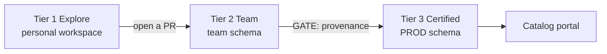

# 01 — Development Workflow Overview

## 1. The problem, stated precisely

Business users and analysts build Streamlit dashboards. Those dashboards break. The data engineering team gets the ticket, having never seen the code, never reviewed the query, and never agreed to support it.

The instinct is to treat this as a self-service problem and restrict who can build apps. That is the wrong diagnosis. Self-service is working — people are getting value from data without waiting in a queue, which is the point. The actual failure is that **there is no defensible line between a dashboard someone assembled in an afternoon and a dashboard the business now depends on.** Without that line every app defaults to being the platform team's problem.

A line drawn with naming conventions, wiki pages, or a spreadsheet of "official" apps does not hold. It depends on people remembering to update it, and it is unfalsifiable — anyone can claim their app is important.

## 2. The line: deployment provenance

Snowflake records where a Streamlit app's code came from, on the app object itself, written by the deployment mechanism rather than by a person.

```sql
DESCRIBE STREAMLIT CORTEX_AGENTS_DEMO.PUBLIC.CORTEX_AGENT_CHAT_APP;
```

```
default_version_source_location_uri  @...GITHUB_REPO_CORTEX_AGENTS_DEMO/branches/main/agent_app/
default_version_git_commit_hash      15e3e34e80cdc1e8d64b34a1d0b8ad206d002c1b
```

That app's running code traces to a specific commit on a specific branch. You can open that commit and read the diff that produced what users are looking at right now. Nobody typed the hash in, and an app that did not come from a repository cannot produce one.

### Two governed paths, recorded differently

This is the part that is easy to get wrong. There are two legitimate deployment mechanisms and they record provenance in **different places**:

| Path | `source_location_uri` | `git_commit_hash` on app | Where the evidence lives |
|---|---|---|---|
| `CREATE STREAMLIT FROM @git_repo/branches/…` | Git stage path | **populated** | The app object |
| DCM `DEFINE STREAMLIT FROM 'asset://…'` | `asset://<name>` | *empty* | `SHOW DEPLOYMENTS IN DCM PROJECT` |
| Snowsight | internal stage | *empty* | nowhere |

A DCM-deployed app has no commit hash on the object, yet it is the most governed kind of app in the estate: reviewed, CI/CD-deployed, reproducible, with full deployment history. An audit keyed only on `git_commit_hash` reports it as ungoverned — a false positive on your best work.

So the gate accepts either form:

```sql
-- governed if EITHER holds
git_commit_hash IS NOT NULL      -- deployed direct from a Git repository
OR managed by a DCM project      -- deployed through a reviewed CI/CD pipeline
```

Everything else is a side project.

## 3. The three-tier model



| | Tier 1 Explore | Tier 2 Team | Tier 3 Certified |
|---|---|---|---|
| Where | Personal workspace | Team schema | PROD schema |
| Owner | Individual user | Named team owner role | **Functional role, never a person** |
| Source of truth | Whatever is in the workspace | Feature branch | Immutable Git tag |
| Deployed by | The user | `snow streamlit deploy` | DCM project via CI/CD identity |
| Provenance | none | present | present, matches a tag |
| Data | Non-sensitive only | Team-scoped | Governed, policy-covered |
| In the catalog | no | no | **yes** |
| **Platform supports it** | **no** | **no** | **yes** |
| When it breaks | Owner fixes or deletes it | Owning team fixes it | Incident, on-call, rollback |
| Retention | Expire after inactivity | Reviewed annually | Reviewed with a retirement date |

### Why this solves the support problem

The tier is derived from a property of the object, not from an opinion. When a Tier 1 app breaks, the conversation is not a negotiation — it is a query. The owner can see their app has no provenance, and the path to getting support is visible and self-service: put it in Git, open a PR, let it be deployed properly.

That reframes the platform team from gatekeeper to provider of a promotion path.

### Tiers are cheap to move between, deliberately

The point is not to make Tier 3 hard to reach. It is to make the *cost of support* proportional to the *evidence of care*. A Tier 1 experiment should take thirty seconds to start. Promotion to Tier 3 should take a pull request, not a committee.

## 4. Lifecycle

| Phase | What happens | Tier |
|---|---|---|
| **Explore** | Someone has a question. They open a workspace, write an app, look at data. Most apps end here and that is correct. | 1 |
| **Share** | It turns out to be useful to a team. Source moves to a Git-backed workspace on a feature branch; a named team role owns it. | 2 |
| **Certify** | The business depends on it. It gets a functional owner role, a DCM project, a registry entry, and a support commitment. | 3 |
| **Operate** | Monitored via the event table and `snow streamlit logs`. Changes arrive as reviewed PRs. | 3 |
| **Retire** | Removing the `DEFINE STREAMLIT` statement drops the app on the next deployment. Retirement is a reviewed code change, not a forgotten object. | 3 |

Retirement deserves emphasis. In the audited account, 68 of 81 apps were over a year old and 23 were scratch or debug apps. Nothing in the current process ever removes anything, so the estate only grows. A lifecycle without a retirement step is not a lifecycle.

## 5. What this preserves

The reason analysts move off BI tools toward Streamlit is usually custom SQL and version tracking. This pattern preserves both, not as a concession but as a direct consequence of its design:

- **Custom SQL** lives in the repository as reviewable code, not buried in tool-specific config.
- **Version tracking** is Git, with the deployed object pointing back at the commit.
- **Diffs** are ordinary code review.

Governance and the thing analysts wanted are the same mechanism here. That is worth saying explicitly, because governance is usually presented as the tax you pay for capability.

## 6. Where to start

The order matters, because step 2 is a dependency almost nobody prices in.

| # | Step | Why first |
|---|---|---|
| 1 | Run the audit on your own account | You cannot plan against an estate you have not measured |
| 2 | **Triage legacy `ROOT_LOCATION` apps** | These *cannot* use Git or the container runtime. 74% of the audited estate. Gates everything else. |
| 3 | Pin exact Streamlit versions on business-facing apps | 100% of audited apps were unpinned and can change behaviour with no code edit |
| 4 | Stand up `SIS_DEVELOPER` and functional owner roles | Unblocks self-service without admin rights |
| 5 | Move one real app to Git + DCM as the reference | A worked example beats a document |
| 6 | Recreate admin-owned production apps under functional roles | 80% of audited apps hand admin rights to every viewer |

Step 6 says *recreate*, not *re-own*. Streamlit ownership cannot be transferred — see [04](04_rbac_and_ownership.md).

## 7. Out of scope here

Mobile access for executives and scheduled PDF delivery are real requirements, but they are consumption-side product gaps rather than development workflow. They are tracked separately and are not solvable by anything in this document set. Recording them here so they are visibly parked rather than quietly dropped.

---

Next: [02 — Git Strategy](02_git_strategy.md)
